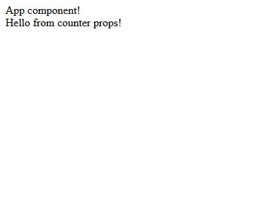

# Custom Component Parameters

Two parameters will be sent to each component that you create yourself: props and an object with "liba".
Let's look at this with Сounter from the previous example.
```typescript title="src/Counter.component.ts"
import {ComponentLibaParam, RenderParams} from "types";

type Props = {
    text: string
}

export const CounterComponent = (props: Props, {liba}: ComponentLibaParam) => {
    const element = document.createElement('div');
    console.log('props', props)
    return {
        element,
        props
    };
}

CounterComponent.render = ({element, props}: RenderParams<Props>) => {
    element.append(props.text);
};
```
:::info

Also pay attention to the typing of RenderParams, the first generic it takes is the props type that is returned from the functional component 
(it may not match the type that comes to the component from the parent, if you decide to extend this object).
:::


Here the text from the parent component will be passed as props.
```typescript title="src/App.component.ts"
import {RenderParams} from "types";
import {CounterComponent} from "./Counter.component";

export const AppComponent = () => {
    const element = document.createElement('div');

    return {
        element,
    };
};

AppComponent.render = ({element, liba}: RenderParams) => {
    element.append('App component!')
    const counterInstance = liba.create(CounterComponent, {text: 'Hello from counter props!'})
    element.append(counterInstance.element)
};
```

And this is what we will see in the browser:


