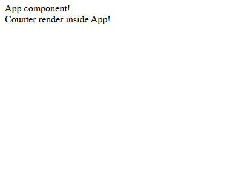

# Render Method

For each functional component that you create, a mandatory **render method** must be declared. 
Thanks to this method, your application comes to life and is displayed in the browser.

But in order for this method to be able to display any element in the browser, you need to create it.
```typescript title="src/App.component.ts"
import {RenderParams} from "types";

export const AppComponent = () => {
    const element = document.createElement('div');

    return {
        element,
    };
};
```
You are returning an object from a functional component, 
one of the keys of which will be the created node of the DOM tree.

And then, in the render method, you will receive an object as parameters, 
one of the keys of which will be your element, which you returned from the component.
```typescript title="src/App.component.ts"
import {RenderParams} from "types";

export const AppComponent = () => {
    const element = document.createElement('div');

    return {
        element,
    };
};

AppComponent.render = ({element}: RenderParams) => {
    element.append('App component!')
};
```
Since this element is a DOM-node, all DOM-node methods are available to it, for example append. 

Now let's create the second component and display it inside our App!

```typescript title="src/Counter.component.ts"
import {RenderParams} from "types";

export const CounterComponent = () => {
    const element = document.createElement('div');

    return {
        element,
    };
}

CounterComponent.render = ({element}: RenderParams) => {
    element.append('Counter render inside App!');
};
```

And now let's display it in our App component:
```typescript title="src/App.component.ts"
import {RenderParams} from "types";
import {CounterComponent} from "./Counter.component";

export const AppComponent = () => {
    const element = document.createElement('div');

    return {
        element,
    };
};

AppComponent.render = ({element, liba}: RenderParams) => {
    element.append('App component!')
    const counterInstance = liba.create(CounterComponent)
    element.append(counterInstance.element)
};
```
And we will get the following display in the browser:



Now you have seen the second key from the parameters object inside the render method, 
which allows you to **create child components inside the parent component**.
