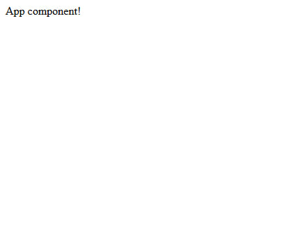

# Setup and Organization

After successfully installing the LibaJS package, you need to set up an **entry point** in your future application.

To do this, you create an **index.html** file and specify the path to the **future index.js** file in it.
```html title="src/index.html"
<!DOCTYPE html>
<html lang="en">
<head>
    <meta charset="UTF-8">
    <title>LibaJs</title>
</head>
<body>
<div id="root"></div>
<script src="../dist/index.js" type="module"></script>
</body>
</html>
```

Then you create an index.ts file, inside which you should **find the root element of your 
index.html** and put the main parent component of your application in it - the **App component.**
```typescript title="src/index.ts"
import {AppComponent} from "./App.component";
import {Liba} from "./LibaJS";

const rootElement = document.getElementById('root')
const appInstance = Liba.create({ComponentFunction: AppComponent})

if (rootElement) {
    rootElement.append(appInstance.element)
}
```
Now, having imported LibaJS from the installed package, all we have to do is create the App component.
```typescript title="src/App.component.ts"
import {RenderParams} from "types";

export const AppComponent = () => {
    const element = document.createElement('div');

    return {
        element,
    };
};

AppComponent.render = ({element}: RenderParams) => {
    element.append('App component!')
};
```
That's it, now all that's left is to run our application. 
To do this, open the terminal of your code editor and type:
```bash
tsc
```
At the output, you will get a dist folder. 
Now all you have to do is open your index.html in the browser and see your application!


